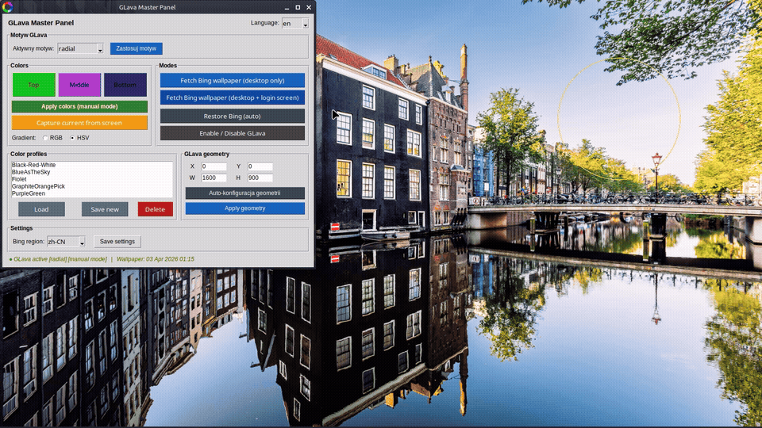
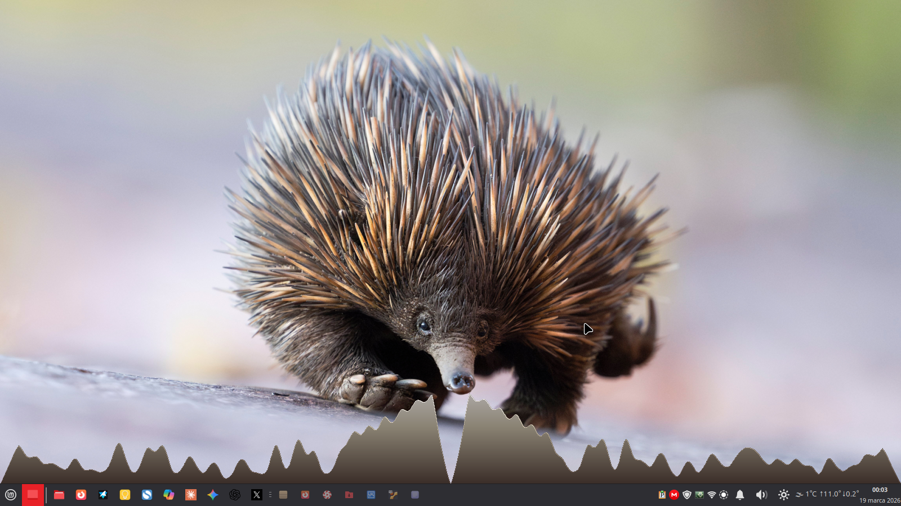
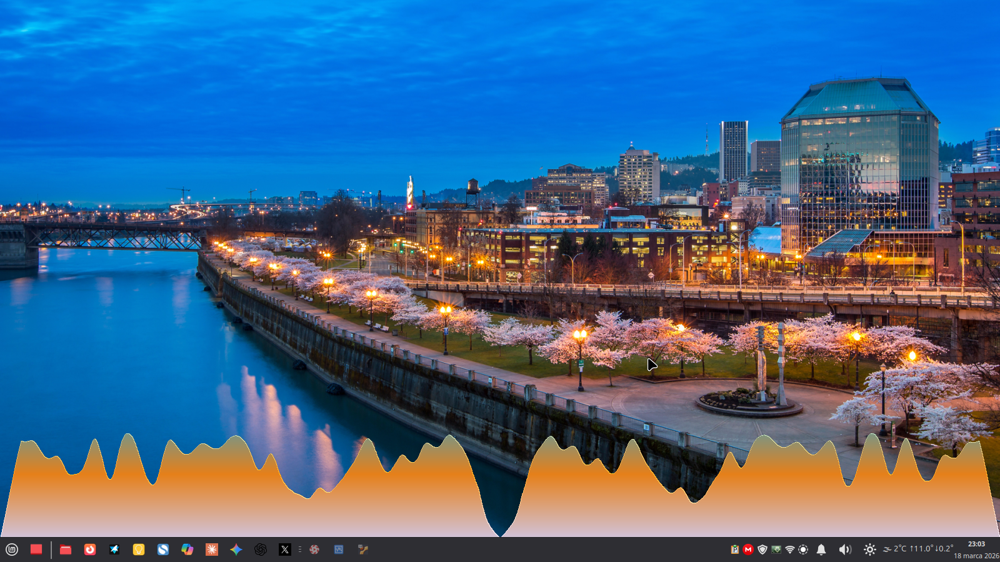
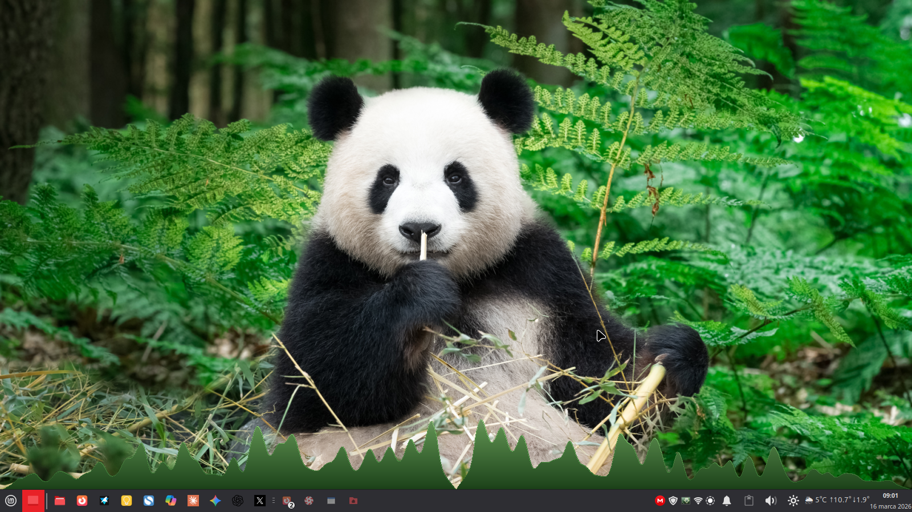

# bing-glava-suite

> GLava lives inside config files. Until now.



Type X, Y, W, H. Click Apply. See it move.  
No config editing. No restarting. No guessing.

**Linux Mint 22.x / Ubuntu 24.04 · XFCE (full) · Cinnamon (partial)**

---

```bash
git clone https://github.com/Krzysztofci/bing-glava-suite.git
cd bing-glava-suite
sudo ./install.sh
```

---

## What you get

**1. Live geometry control**  
Position and resize GLava exactly where you want it — directly from the GUI.  
X, Y, width, height. Apply. Done. The visualizer moves instantly.

This is what GLava power users do in config files, except here it takes 5 seconds instead of 20 minutes.

**2. Automatic colors from your wallpaper**  
The suite watches your wallpaper. When it changes, it extracts the 3 dominant colors using KMeans and updates the GLava shader automatically. No action needed.

**3. Daily Bing wallpapers**  
A fresh UHD photo every day, set as desktop background and login screen. This is what feeds the color engine.

---

## Screenshots

Colors extracted automatically from the wallpaper:







---

## GUI panel

```bash
glava-gui
```

- set GLava position and size (X / Y / W / H)
- auto-detect geometry based on your screen and panels
- pick colors manually, save as presets
- switch modules: graph / bars / circle / wave / radial
- RGB or HSV gradient mode
- fetch today's Bing wallpaper on demand
- restore automatic color mode anytime

Everything is optional. The suite runs fine without ever opening the panel.

---

## Requirements

- Linux Mint 22.x or Ubuntu 24.04
- XFCE (full support) or Cinnamon (wallpaper only)
- A compositor running (picom, compton, or the built-in one)
- GLava — the installer will offer to download a ready-made `.deb` if not installed

---

## How it works

```
cron (every N minutes)
  └─► downloads wallpaper from Bing (UHD)
        └─► sets desktop + login screen background
              │
              │  file change detected (inotify)
              ▼
systemd user service
  └─► KMeans extracts 3 dominant colors
        └─► updates GLava shader
              └─► restarts GLava with new theme
```

The daemon respects manual overrides — set colors by hand and it won't touch them until you say so.

---

## Installation

The installer will ask for:
- your username
- cron interval (how often to fetch a new wallpaper, default: 15 min)
- whether to download the GLava `.deb` automatically

### GLava — pre-built package (recommended)

Download `glava_1.6.3_amd64.deb` from [Releases](https://github.com/Krzysztofci/bing-glava-suite/releases):

```bash
sudo dpkg -i glava_1.6.3_amd64.deb
sudo apt --fix-broken install   # if needed
```

### GLava — compile from source

For other distros or architectures — see [BUILDING.md](BUILDING.md).

---

## After installation

```bash
# Start the daemon without logging out
systemctl --user start glava-color-daemon

# Fetch today's wallpaper right now (optional)
sudo /usr/local/bin/bing-downloader.sh $(whoami)
```

On next login the service starts automatically.

---

## Useful commands

```bash
glava-toggle          # enable / disable GLava
glava-colors-auto     # force color update from current wallpaper

systemctl --user status glava-color-daemon
systemctl --user restart glava-color-daemon

tail -f ~/.local/logs/glava-color-daemon.log
```

---

## Known limitations

- GLava requires hardware OpenGL — won't work in VMs with software rendering
- The `.deb` package targets Ubuntu 24.04 / Linux Mint 22.x (amd64) — other systems need a source build
- Multiple accounts supported — run the installer once per user

---

## Uninstall

```bash
systemctl --user disable --now glava-color-daemon

rm -f ~/.local/bin/bing-downloader.sh \
      ~/.local/bin/bing-fetch-user.sh \
      ~/.local/bin/glava-color-daemon \
      ~/.local/bin/glava-colors-auto \
      ~/.local/bin/glava-colorswitch \
      ~/.local/bin/glava-toggle \
      ~/.local/bin/glava-gui \
      ~/.local/bin/glava-gui.py

rm -f ~/.config/systemd/user/glava-color-daemon.service
systemctl --user daemon-reload

sudo crontab -l | grep -v "bing-downloader" | sudo crontab -
sudo rm -f /usr/local/bin/bing-downloader.sh
```

---

## License

MIT — see [LICENSE](LICENSE).
