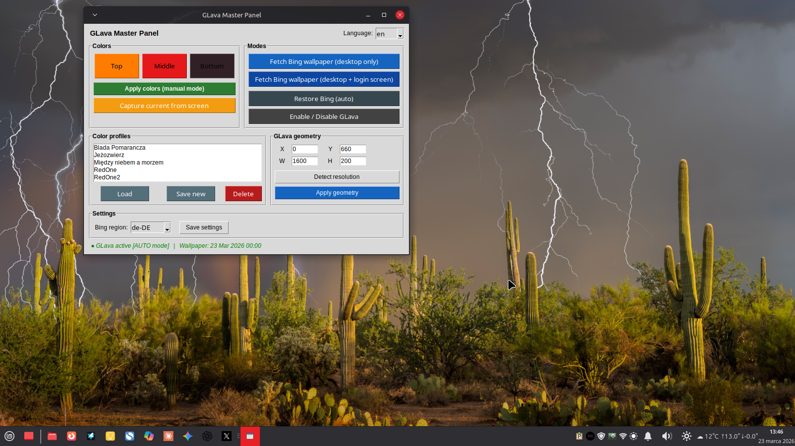

# bing-glava-suite

Automatyczne tapety Bing z dopasowaniem kolorów GLava dla systemów Linux.

> **GLava Suite brings together Bing’s daily wallpapers and GLava’s audio‑reactive visualizer, with automatic color matching and a brand‑new GUI panel.
One command, full setup, zero hassle. English summary below the Polish documentation.**

---

## Screenshoty

Kolory GLava automatycznie dopasowane do tapety Bing:


Panel sterowania GUI:



---

## Co to robi?

Projekt składa się z dwóch niezależnych, ale współpracujących mechanizmów:

**1. Pobieranie tapety Bing**
Regularnie (przez cron) skrypt pobiera dzisiejsze zdjęcie dnia z Bing w rozdzielczości UHD, ustawia je jako tapetę pulpitu (XFCE i/lub Cinnamon) oraz tło ekranu logowania LightDM. Region Bing konfigurowalny przez GUI lub plik `~/.config/bing-glava/config`.

**2. Automatyczne kolory GLava**
Usługa systemd nasłuchuje zmian pliku tapety. Gdy tapeta się zmieni, algorytm KMeans analizuje jej 3 dominujące kolory i aktualizuje shader GLava — wizualizator audio dopasowuje się do tapety bez żadnej ingerencji użytkownika.

**3. Panel GUI**
Panel sterowania pozwala ręcznie dobierać kolory, zapisywać własne presety, konfigurować geometrię GLava, zmieniać region Bing i pobierać tapetę na żądanie. Daemon szanuje wybór użytkownika i nie nadpisuje ustawień ręcznych.

---

## Wymagania

### System
- Linux (testowano na Linux Mint 22.3 XFCE i Cinnamon)
- Środowisko graficzne: **XFCE** (pełne wsparcie) lub **Cinnamon** (tapety)
- `systemd` z obsługą usług użytkownika (`systemctl --user`)
- Kompozytor okien (picom, compton lub wbudowany w XFCE/Cinnamon) — wymagany przez GLava

### Pakiety (instalowane automatycznie przez `install.sh`)
| Pakiet | Do czego |
|---|---|
| `curl`, `wget`, `jq` | Pobieranie tapety Bing |
| `inotify-tools` | Wykrywanie zmian tapety przez daemon |
| `python3`, `python3-pil`, `python3-sklearn`, `python3-numpy` | Analiza kolorów tapety |
| `python3-tk` | Panel GUI |

### GLava
Wizualizator audio GLava jest wymagany do działania projektu. Instalator automatycznie zaproponuje pobranie gotowej paczki `.deb` jeśli GLava nie jest zainstalowana.

---

## Instalacja GLava

### Opcja 1 — gotowa paczka .deb (zalecana, Ubuntu 24.04 / Linux Mint 22.x)

Pobierz plik `glava_1.6.3_amd64.deb` z [Releases](https://github.com/Krzysztofci/bing-glava-suite/releases):

```bash
sudo dpkg -i glava_1.6.3_amd64.deb
# W razie problemów z zależnościami:
sudo apt --fix-broken install
```

### Opcja 2 — kompilacja ze źródeł

Dla innych dystrybucji lub architektur:

```bash
# Zależności do kompilacji
sudo apt install -y \
    libpulse-dev libgl-dev libglx-dev libx11-dev libxext-dev \
    libxrender-dev libxcomposite-dev meson ninja-build \
    pkg-config gcc g++ git

# Pobierz źródła
git clone https://github.com/jarcode-foss/glava
cd glava

# Poprawki kompatybilności z GCC 13 (Ubuntu 24.04+)
sed -i '/#include <error.h>/a #include <cstdio>\n#include <cerrno>' glfft/glfft_gl_interface.hpp
sed -i '/#include "glfft.hpp"/a #include <stdexcept>' glfft/glfft_wisdom.cpp
sed -i '1s/^/#include <cstdio>\n/' glfft/glfft_gl_interface.cpp
sed -i 's/__attribute__((noreturn, visibility("default"))) void (\*glava_abort)/extern __attribute__((noreturn, visibility("default"))) void (*glava_abort)/' glava/glava.h
sed -i 's/__attribute__((noreturn, visibility("default"))) void (\*glava_return)/extern __attribute__((noreturn, visibility("default"))) void (*glava_return)/' glava/glava.h

# Kompilacja i instalacja
meson build --prefix /usr -Ddisable_obs=true
ninja -C build
sudo ninja -C build install
```

### Konfiguracja GLava po instalacji

```bash
glava --copy-config
sudo chown -R $USER:$USER ~/.config/glava

# Zastąp symlinki prawdziwymi katalogami
rm -rf ~/.config/glava/bars && cp -r /etc/xdg/glava/bars ~/.config/glava/bars
rm -rf ~/.config/glava/graph && cp -r /etc/xdg/glava/graph ~/.config/glava/graph
sudo chown -R $USER:$USER ~/.config/glava
```

> **Uwaga:** Warningi `using "window" transform explicitly is deprecated` są normalne.

---

## Instalacja projektu

```bash
git clone https://github.com/Krzysztofci/bing-glava-suite.git
cd bing-glava-suite
sudo ./install.sh
```

Instalator zapyta o:
- nazwę użytkownika
- interwał crona (co ile minut pobierać tapetę, domyślnie 15)
- czy pobrać GLavę automatycznie (jeśli nie jest zainstalowana)

Następnie zainstaluje zależności, skopiuje skrypty, skonfiguruje cron i usługę systemd.

### Po instalacji

```bash
# Uruchom usługę systemd (bez wylogowywania)
systemctl --user start glava-color-daemon

# Pobierz pierwszą tapetę ręcznie (opcjonalnie)
sudo /usr/local/bin/bing-downloader.sh $(whoami)
```

Przy kolejnych logowaniach usługa startuje automatycznie.

---

## Struktura projektu

```
bing-glava-suite/
├── install.sh                      # Instalator
├── LICENSE                         # Licencja MIT
├── README.md
├── config/
│   ├── bing-glava.conf             # Domyślny plik konfiguracyjny użytkownika
│   └── graph_red.frag              # Autorski szablon shadera GLava
├── desktop/
│   ├── glava-gui.desktop           # Skrót w menu: Panel GLava
│   ├── glava-toggle.desktop        # Skrót w menu: Włącz/Wyłącz GLava
│   └── glava.directory             # Definicja kategorii menu
├── glava-config/                   # Konfiguracja GLava (rc.glsl, shadery)
├── lang/
│   ├── pl.json                     # Tłumaczenie polskie
│   └── en.json                     # Tłumaczenie angielskie
├── scripts/
│   ├── bing-downloader.sh          # Systemowy skrypt tapety (→ /usr/local/bin/)
│   ├── bing-fetch-user.sh          # Lekki skrypt użytkownika (bez sudo)
│   ├── build-glava-deb.sh          # Skrypt budujący paczkę .deb z GLava
│   ├── glava-color-daemon          # Demon inotifywait → auto kolory
│   ├── glava-colors-auto           # Generowanie kolorów z tapety (KMeans)
│   ├── glava-colorswitch           # Toggle tryb auto ↔ czerwony (ukryty)
│   ├── glava-toggle                # Włącz/wyłącz GLava
│   └── glava-gui.py                # Panel GUI (Tkinter)
└── systemd/
    └── glava-color-daemon.service
```

---

## Jak to działa — przepływ danych

```
cron (root, co N minut)
  └─► /usr/local/bin/bing-downloader.sh <użytkownik>
        ├─► czyta ~/.config/bing-glava/config (region)
        ├─► ~/Pictures/Bing/bing_today.jpg  (tapeta)
        ├─► /usr/share/backgrounds/login-bing.jpg  (ekran logowania)
        └─► xfconf-query / gsettings  (ustawia tapetę w DE)
                │
                │ (zmiana pliku wyzwala inotifywait)
                ▼
systemd user service: glava-color-daemon
  └─► glava-colors-auto
        ├─► KMeans → 3 kolory dominujące
        └─► ~/.config/glava/graph/1.frag  (zaktualizowany shader)
              └─► restart glava --desktop

GUI (opcjonalne)
  ├─► bing-fetch-user.sh --force   (tapeta bez sudo, tylko pulpit)
  └─► /usr/local/bin/bing-downloader.sh + zenity  (tapeta + LightDM)
```

---

## Konfiguracja użytkownika

Plik `~/.config/bing-glava/config` tworzony automatycznie podczas instalacji:

```bash
# Region Bing — skąd pobierana jest tapeta
# Dostępne: de-DE, en-US, en-GB, fr-FR, es-ES, it-IT, pt-BR, ja-JP, zh-CN, pl-PL
BING_REGION=de-DE
```

Region można zmienić przez GUI (sekcja Ustawienia) lub edytując plik ręcznie.

---

## Flagi stanu

Pliki flag w `~/.config/glava/` sterują zachowaniem daemona i GUI:

| Plik | Znaczenie |
|---|---|
| `manual.shift` | Kolory ustawione przez GUI — daemon nie nadpisuje |
| `red.shift` | Tryb RED — daemon nie nadpisuje kolorów |
| `.glava_disabled` | GLava wyłączona przez użytkownika — daemon jej nie uruchamia |

Flagi są usuwane przez **„Przywróć Bing (auto)"** w GUI.

---

## Panel GUI

Uruchomienie:
```bash
glava-gui
# lub
python3 ~/.local/bin/glava-gui.py
```

Funkcje panelu:
- Ręczny dobór kolorów (góra/środek/dół wykresu) z zapisem presetów
- Pobieranie tapety Bing na żądanie (pulpit lub pulpit + ekran logowania)
- Przywracanie trybu auto (kolory z tapety)
- Włączanie/wyłączanie GLava
- Konfiguracja geometrii GLava (pozycja X/Y, szerokość, wysokość)
- Wybór regionu Bing
- Wybór języka (PL/EN, rozszerzalny przez pliki `lang/*.json`)

---

## Terminal

```bash
glava-toggle       # włącz/wyłącz GLava
glava-colors-auto  # wymuś regenerację kolorów z tapety
```

### Usługa systemd
```bash
systemctl --user status glava-color-daemon
systemctl --user restart glava-color-daemon
systemctl --user stop glava-color-daemon
```

### Logi
```bash
tail -f ~/.local/logs/glava-color-daemon.log
tail -f ~/.local/logs/bing-downloader.log
```

---

## Wielojęzyczność

Panel GUI obsługuje wiele języków. Pliki tłumaczeń znajdują się w katalogu `lang/`. Aby dodać własny język, stwórz plik `lang/xx.json` wzorując się na istniejących tłumaczeniach.

---

## Znane ograniczenia

- **GLava wymaga sprzętowego OpenGL** — nie działa w maszynach wirtualnych z software renderingiem.
- **Paczka `.deb`** — zbudowana dla Ubuntu 24.04 / Linux Mint 22.x (amd64). Na innych systemach kompiluj ze źródeł.
- **XFCE:** skrypt używa `xfdesktop` i `xfconf-query` przez `su -c` ze względu na ograniczenia DBUS.
- **Wiele kont:** instalator można uruchomić wielokrotnie dla różnych użytkowników — każdy dostaje osobny wpis w cronie roota.

---

## Deinstalacja

```bash
# Wyłącz usługę
systemctl --user disable --now glava-color-daemon

# Usuń skrypty użytkownika
rm -f ~/.local/bin/bing-downloader.sh \
       ~/.local/bin/bing-fetch-user.sh \
       ~/.local/bin/glava-color-daemon \
       ~/.local/bin/glava-colors-auto \
       ~/.local/bin/glava-colorswitch \
       ~/.local/bin/glava-toggle \
       ~/.local/bin/glava-gui \
       ~/.local/bin/glava-gui.py

# Usuń unit systemd
rm -f ~/.config/systemd/user/glava-color-daemon.service
systemctl --user daemon-reload

# Usuń wpis cron (jako root)
sudo crontab -l | grep -v "bing-downloader" | sudo crontab -

# Usuń skrypt systemowy (opcjonalnie, jeśli nie ma innych użytkowników)
sudo rm -f /usr/local/bin/bing-downloader.sh
```

---

## Licencja

**MIT License** — szczegóły w pliku `LICENSE`.

---

---

## English Summary

**bing-glava-suite** automatically downloads the Bing daily wallpaper (UHD), sets it as the desktop background (XFCE / Cinnamon) and login screen, then uses KMeans colour analysis to update GLava's audio visualizer shader colours to match the wallpaper — all without user intervention.

**Components:**
- `/usr/local/bin/bing-downloader.sh` — system-level cron script (root), accepts username as argument, reads region from user config
- `~/.local/bin/bing-fetch-user.sh` — lightweight user script, fetches wallpaper without sudo (desktop only)
- `glava-color-daemon` — systemd user service, watches wallpaper via `inotifywait`, triggers colour update
- `glava-colors-auto` — Python/KMeans script, writes dominant colours to GLava shader
- `glava-toggle` — enable/disable GLava
- `glava-gui.py` — Tkinter GUI: colour presets, geometry config, region/language settings
- `config/bing-glava.conf` — per-user configuration (Bing region)
- `config/graph_red.frag` — custom GLava shader template (installed automatically)

**GLava installation:** A pre-built `.deb` package for Ubuntu 24.04 / Linux Mint 22.x is available in [Releases](https://github.com/Krzysztofci/bing-glava-suite/releases). For other systems, compile from source (see Polish section above for GCC 13 patches).

**Install:** `sudo ./install.sh` — prompts for username and cron interval, installs dependencies, optionally downloads GLava `.deb`, sets up cron and systemd service. Supports multiple user accounts.

**License:** MIT License.
