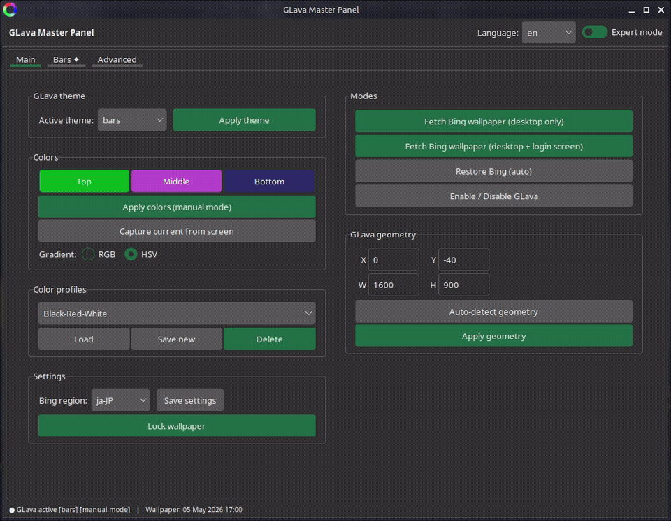

# bing-glava-suite

A Linux desktop toolkit that downloads the daily Bing wallpaper and automatically
synchronizes GLava's audio visualizer colors with it — with a full GUI control panel
for fine-tuning everything.

> Tested on **Linux Mint / XFCE** · Lenovo ThinkPad T420 · Intel HD 3000

---
## Usage

### GUI

```bash
glava-gui
```

The GUI panel has three tabs:



- **Main** — wallpaper lock toggle, manual color picker, color presets, module switcher
- **Module** — per-module controls (colors, gradient mode, rotation, position, profiles)
- **Advanced** — geometry, FPS cap, GLava restart


## Shader modules

Each module has an independent control panel in the GUI with:

- **Color gradient** — two color endpoints, HSV or RGB interpolation
- **Shader profiles** — named presets saved per module
- **Rotation** — 0–360° slider (where the shader supports it)
- **Position offsets** — X/Y sliders for fine placement
- **HSV color wheel** — shortest-path hue interpolation for smooth gradients

| Module | Style |
|---|---|
| `bars` | Classic frequency bars |
 | 
| `graph` | Waveform / spectrum graph anchored to taskbar |

| `circle` | Circular amplitude ring |

| `radial` | Radial spokes with rotation |
 
| `wave` | Horizontal wave/Verical wave/Rotation Wave |


---

## Features

- **Daily Bing wallpaper** — downloaded automatically via cron, set as desktop background
- **KMeans color extraction** — dominant colors are pulled from the wallpaper and applied to GLava
- **GLava GUI control panel** — Tkinter-based, modular, themeable (Forest TTK)
- **5 shader modules** — bars, circle, wave, radial, graph — each with its own control panel
- **HSV / RGB gradient modes** per module
- **Shader profiles** — save, load, delete and reset named presets per module
- **Auto geometry detection** — GLava window size and position set automatically from screen resolution and taskbar height
- **Rotation and position offsets** — sliders per module (0–360° rotation, X/Y offset)
- **Wallpaper lock** — prevent auto-color changes when you want to keep a manual color scheme
- **systemd user service** — inotify daemon watches for wallpaper changes and restarts GLava
- **Internationalization (i18n)** — English and Polish UI (switchable at runtime)
- **Installer and uninstaller** — single `install.sh` covers everything including GLava

---

## Requirements

| Dependency | Notes |
|---|---|
| `python3` + `python3-tk` | GUI |
| `python3-pil` | Wallpaper image processing |
| `python3-sklearn` + `python3-numpy` | KMeans color extraction |
| `curl`, `wget`, `jq` | Wallpaper download and API queries |
| `inotify-tools` | Wallpaper change detection |
| `x11-utils` | Screen geometry detection (`xprop`) |
| `libgl1`, `libglx-mesa0`, `libgl1-mesa-dev`, `libglvnd0` | OpenGL for GLava |
| **GLava** | Audio visualizer — installer can fetch it automatically |

The installer checks and installs all apt packages automatically.

---

## Installation

```bash
git clone https://github.com/Krzysztofci/bing-glava-suite.git
cd bing-glava-suite
sudo ./install.sh
```

The installer will:

1. Ask which user to install for (default: current sudo user)
2. Ask how often to download a new wallpaper (default: every 15 minutes)
3. Check and install missing apt packages — with a live progress bar
4. Offer to download and install GLava automatically (pre-built `.deb` from Releases)
5. Copy all scripts, GUI files, shaders and configs to the correct locations
6. Register a systemd user service and a cron job
7. Optionally download today's wallpaper immediately

After installation, **log out and back in** — everything starts automatically.

### Manual GLava start (without logging out)

```bash
systemctl --user start glava-color-daemon
glava --desktop &
```

---

## Configuration files

### Wallpaper downloader — `~/.config/bing-glava/config`

```bash
WALLPAPER_DIR="$HOME/Pictures/Bing"
LOCK=0          # 1 = don't update GLava colors on wallpaper change
```

### GLava — `~/.config/glava/rc.glsl`

Geometry, FPS cap and active module are managed by the GUI and installer.
Manual edits are fine — the GUI reads the file on startup.

---

### Scripts

| Script | Purpose |
|---|---|
| `glava-toggle` | Enable / disable GLava |
| `glava-colorswitch` | Apply a color scheme manually |
| `glava-colors-auto` | Re-extract colors from current wallpaper |
| `glava-color-daemon` | The inotify daemon (managed by systemd) |
| `bing-fetch-user.sh` | Download today's Bing wallpaper on demand |

---

## Directory layout (after install)

```
~/.local/bin/
├── GlavaMP/                   # GUI and modules
│   ├── glava-gui.py
│   └── gui/
│       ├── modules/           # bars.py, circle.py, wave.py, radial.py, graph.py
│       └── ...
└── glava-toggle, glava-colorswitch, ...

~/.config/
├── GlavaMP/                   # GUI config: profiles, preferences
├── glava/                     # GLava shaders and rc.glsl
│   ├── bars_colors.frag
│   ├── circle_colors.frag
│   └── ...
└── bing-glava/                # Wallpaper downloader config

~/.local/share/bing-glava-suite/
└── lang/                      # en.json, pl.json
```

---

## Uninstall

```bash
sudo ./uninstall.sh
```

Removes scripts, GUI files, systemd service and cron entry.
GLava itself and wallpapers are left untouched.

---

## Troubleshooting

**GLava doesn't start / black screen**
Run `glava --desktop` in a terminal to see error output.
Make sure `XDG_RUNTIME_DIR` is set: `echo $XDG_RUNTIME_DIR` should return `/run/user/XXXX`.

**Colors don't update after wallpaper change**
Check the daemon: `systemctl --user status glava-color-daemon`.
If it's inactive, start it manually and check the log at `~/.local/logs/`.

**GUI shows "⚠ RGB only" warning**
The active shader doesn't have `#define HSV_MODE` embedded.
Run the installer again or copy the template shader manually:
```bash
cp ~/.config/glava/bars_colors.frag ~/.config/glava/bars/1.frag
```

**Intel GPU freeze (ThinkPad / older Intel hardware)**
Make sure these kernel parameters are set in `/etc/default/grub`:
```
i915.enable_rc6=0 i915.enable_dc=0 i915.disable_power_well=0
```

---

## Changelog highlights

| Version | Summary |
|---|---|
| `0.5.0` | i18n complete (EN/PL), Forest TTK theme, resizable window |
| `0.3.x` | Modular GUI architecture, shader profiles, rotation/offset sliders |
| `0.2.2` | HSV_MODE define replaces regex block-replacement, auto geometry fix |
| `0.2.1` | Wallpaper lock, bars gradient fix |
| `0.2.0` | Multi-module support, auto geometry, security hardening |
| `0.1.0-beta` | GUI first version, color presets, GLava auto-install |
| `0.1.0-alpha` | First public release — wallpaper + KMeans + inotify daemon |

Full history: [CHANGELOG.md](CHANGELOG.md)

---

## License

[MIT](LICENSE) — KrzysztofCi
