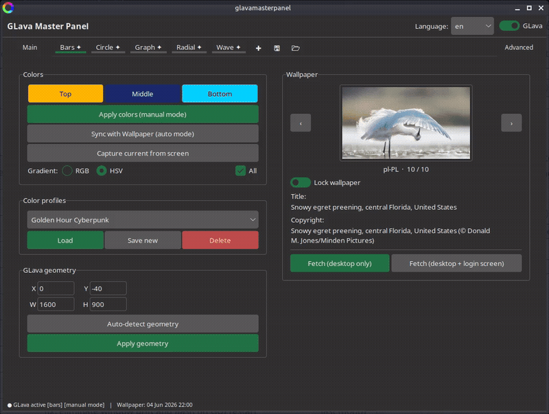
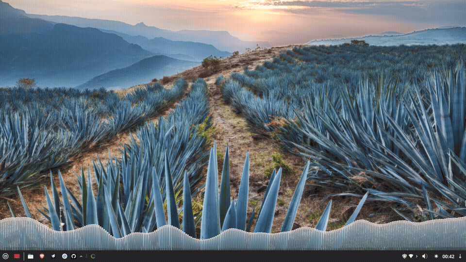
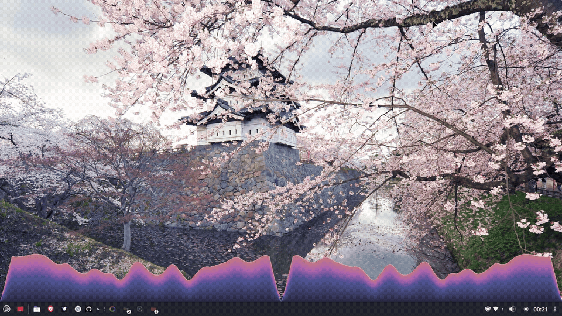
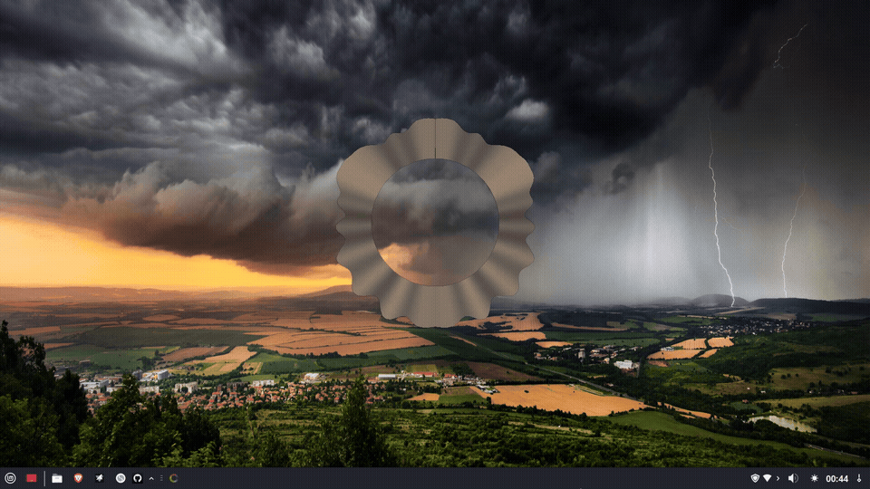
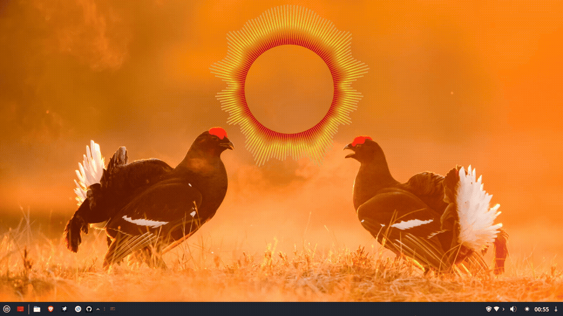
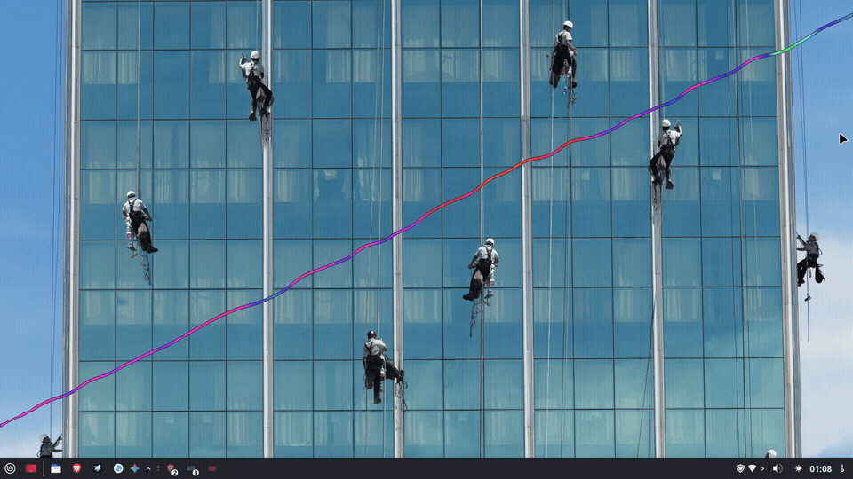

# bing-glava-suite

[](LICENSE)
[](https://github.com/Krzysztofci/bing-glava-suite)
[](https://www.python.org/)
[](https://github.com/Krzysztofci/bing-glava-suite/releases)
[](https://github.com/jarcode-foss/glava)
[](https://github.com/Krzysztofci/bing-glava-suite/actions/workflows/test.yml)
[](https://github.com/Krzysztofci/bing-glava-suite)

**Wieloinstancyjne studio wizualizacji GLava dla pulpitu Linux.**

Automatyczne pobieranie tapet Bing + wizualizator audio GLava z pełną
kontrolą wielu niezależnych instancji uruchomionych jednocześnie,
każda z własnym shaderem, geometrią i schematem kolorów.

Testowane na **Linux Mint 22 XFCE/Cinnamon**, Intel HD 3000 (ThinkPad T420).

> 🇬🇧 [English documentation](README.md)

---

## Funkcje

- **Wiele instancji GLava** — Bars, Wave, Circle, Graph, Radial równocześnie,
  każda w osobnej zakładce
- **Izolacja per instancja** — osobny katalog konfiguracyjny, osobny proces
  GLava, osobne ustawienia shaderów
- **Trwałe sesje** — zakładki i ustawienia przeżywają restart aplikacji
- **Automatyczne tapety Bing** — codzienne pobieranie z wyborem regionu
- **Synchronizacja kolorów KMeans** — ekstrakcja dominujących kolorów z tapety
  i automatyczne aplikowanie do wszystkich instancji GLava
- **Forest-ttk-theme** — spójny ciemny/jasny interfejs
- **Auto-geometria** — automatyczne obliczanie rozmiaru i pozycji GLava
- **Profile szaderów** — zapis i odczyt zestawów parametrów per moduł
- **Pełne i18n** — interfejs w języku polskim i angielskim, przełączany w czasie działania

---

## Zrzuty ekranu



| Bars | Graph | Circle |
|------|-------|--------|
|  |  |  |

| Radial | Wave |
|--------|------|
|  |  |

---

## Instalacja

### Wymagania

- Linux Mint 22 / Ubuntu 24.04 (zalecane)
- Python 3.10+
- Tkinter (`python3-tk`)
- Pillow (`python3-pil`) — do ekstrakcji kolorów
- GLava — użyj gotowego pakietu `.deb` z zakładki Releases lub skompiluj ze źródeł (patrz [BUILDING.md](BUILDING.md))

### Szybka instalacja

```bash
git clone -b feature/modular-gui https://github.com/Krzysztofci/bing-glava-suite.git
cd bing-glava-suite
sudo ./install.sh
```

Instalator:
1. Kopiuje skrypty do `~/.local/bin/`
2. Kopiuje GUI do `~/.local/bin/GlavaMP/`
3. Kopiuje szablon konfiguracji GLava z `/etc/xdg/glava/`
4. Instaluje usługę systemd użytkownika (`glava-color-daemon`)
5. Dodaje `~/.local/bin` do `PATH` w `.bashrc`
6. Konfiguruje cron do codziennego pobierania tapety
7. Tworzy wpis autostartu dla GLava

### Uruchomienie bez instalacji

```bash
cd scripts
python3 glava-gui.py
```

---

## Użytkowanie

### Dodawanie instancji

Kliknij `[✚]` na pasku zakładek → wybierz moduł (Bars / Wave / Circle / Graph /
Radial). Pojawia się nowa zakładka i GLava startuje automatycznie z wybranym
modułem i własnym, izolowanym katalogiem konfiguracyjnym.

### Kontrola zakładek

| Akcja | Efekt |
|-------|-------|
| Klik na zakładkę | Przełącz aktywną instancję |
| Prawy klik na zakładkę | Menu: Zmień nazwę / Zmień shader / Zapisz workspace / Duplikuj / Zamknij |
| Przycisk `[✚]` | Dodaj nową instancję |
| Przycisk 🖫 | Zapisz bieżący workspace |
| Przycisk 🗁 | Wczytaj zapisany workspace |
| Zamknięcie zakładki | Zatrzymuje tylko ten proces GLava |

### Zakładka Główna

Steruje kolorami, gradientem, tapetą i geometrią. Zmiany dotyczą
**aktualnie wybranej zakładki**.

### Zakładka modułu

Parametry shadera per instancja — kształt, wygładzanie, przełączniki.
Każda zakładka ma niezależne ustawienia. Profile szaderów można zapisywać i wczytywać.

### Zakładka Zaawansowane

Ustawienia audio (`setbufsize`, `setsamplesize`, `setsamplerate`) i limit FPS
dotyczą **tylko aktywnej instancji**. Tryb Expert odblokowuje dodatkowe opcje.

### Włączanie / Wyłączanie GLava

Przełącznik Włącz/Wyłącz w zakładce Główna:
- **Wyłącz** — zatrzymuje wszystkie procesy GLava
- **Włącz** — startuje wszystkie zarejestrowane instancje równolegle

---

## Struktura katalogów

```
~/.config/
├── glava/                        ← Katalog wzorcowy (nie instancja)
├── glava-inst-1/glava/           ← Instancja 1 (skopiowana z wzorca)
├── glava-inst-2/glava/           ← Instancja 2
└── GlavaMP/
    ├── instances.json            ← Rejestr zakładek + trwały stan
    ├── profiles.json             ← Profile szaderów (globalne, per moduł)
    ├── presets.json              ← Presety kolorów
    ├── gui.conf                  ← Geometria okna
    └── themes/                   ← Pliki Forest-ttk-theme
```

---

## Znane ograniczenia (v1.0.0-RC5)

- Color picker używa systemowego dialogu Tk — nie pasuje wizualnie do Forest-ttk-theme.
  Własny picker TTK planowany w przyszłej wersji.
- Profile szaderów są globalne per moduł, nie per instancja.
- Workspace nie wczytuje się automatycznie przy starcie GUI — użyj 🗁.
- W niektórych konfiguracjach liczba procesów może się podwoić po rozruchu
  (autostart + daemon). Obejście: toggle OFF/ON po zalogowaniu.

---

## Dokumentacja

| Plik | Opis |
|------|------|
| [ARCHITECTURE.md](ARCHITECTURE.md) / [ARCHITECTURE_PL.md](ARCHITECTURE_PL.md) | Architektura kodu |
| [BUILDING.md](BUILDING.md) | Kompilacja GLava ze źródeł |
| [TESTING.md](TESTING.md) | Scenariusze testów manualnych |
| [CHANGELOG.md](CHANGELOG.md) / [CHANGELOG_PL.md](CHANGELOG_PL.md) | Historia zmian |

---

## Licencja

MIT — patrz [LICENSE](LICENSE)

GLava: GPLv3
Forest-ttk-theme: MIT
